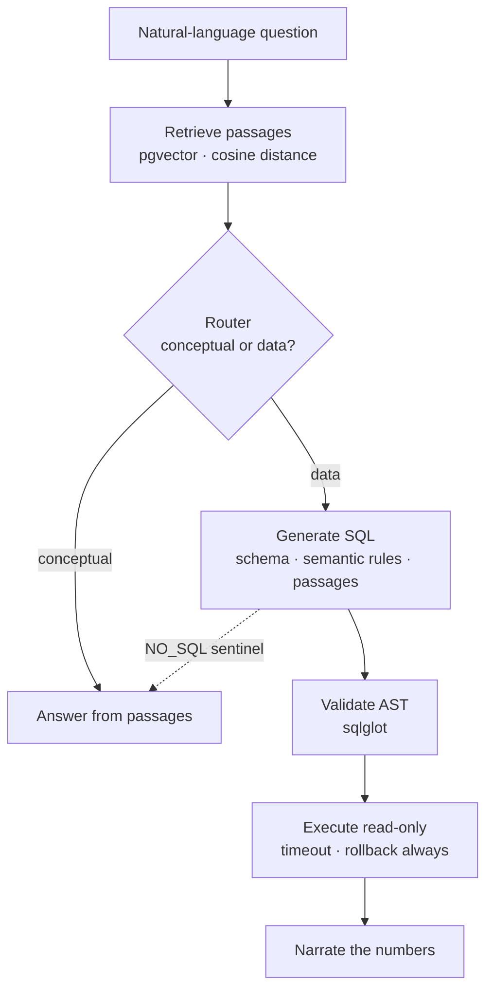

# Rail Punctuality RAG 🚆🤖


A retrieval-augmented question-answering service over a star schema of Belgian rail punctuality data. It answers natural-language questions — *"which station had the worst punctuality in August?"*, *"why do some stations have no ptcar_no?"* — by translating data questions into guarded SQL and answering system questions from a small documentation corpus.

It is the serving half of a two-project portfolio. The upstream project, [`rail-punctuality-lakehouse`](https://github.com/BeatrizJover/rail-punctuality-lakehouse), is a Medallion pipeline on Databricks that produces the Gold star schema. **This repository transforms nothing**: it mirrors that Gold layer into a local PostgreSQL instance and answers questions about it. 

> **Scope note.** The system runs end to end today on a **synthetic Gold extract** generated locally. The bridge that pulls the *real* Gold layer out of Databricks is on the [roadmap](#roadmap), not yet implemented. Everything downstream of the extract — loading, retrieval, SQL generation, guarding, execution, narration — is real and tested.

## Table of Contents

- [Overview](#overview)
- [Architecture](#architecture)
- [Why questions become SQL, not vector search](#why-questions-become-sql-not-vector-search)
- [Correctness by construction](#correctness-by-construction)
- [Guardrails on generated SQL](#guardrails-on-generated-sql)
- [Knowledge base](#knowledge-base)
- [Notable engineering decisions](#notable-engineering-decisions)
- [Repository Structure](#repository-structure)
- [Tech Stack](#tech-stack)
- [Getting Started](#getting-started)
- [Testing](#testing)
- [Roadmap](#roadmap)
- [Author](#author)
- [License](#license)

## Overview

The underlying data is Belgian railway punctuality, published as open data by Infrabel through its OpenDataSoft API. It describes train movements past measuring points on the network. The upstream lakehouse ingests it and models it into a Gold star schema; this service reads a mirror of that schema and answers questions about it.

The design starts from a single observation: **not all questions are the same kind of question.** *"Which relation was least punctual last quarter"* is a question about the **data** — it has an exact numeric answer that requires aggregation over thousands of rows. *"Why is `ptcar_no` often null"* is a question about the **system** — no SQL query answers it; it is answered from documentation. The service routes each question to the path that can actually answer it, behind a single endpoint.

## Architecture

The wider system is split into two planes. The **analytic plane** is Databricks with Unity Catalog, where the Medallion pipeline runs on a schedule and produces the Gold star schema, optimised for throughput over large scans. The **serving plane** — this repository — is PostgreSQL holding a mirror of the Gold layer, optimised for latency on small result sets. The two are connected by a **file export rather than a live query**: a live JDBC connection would put a remote cluster being awake, and a network round trip, on the critical path of every question a local index can answer.

Within the serving plane, a question flows through two possible paths:



The two paths are deliberately **asymmetric**. The data path can *retire* — if the generator decides the question is not really answerable from the tables, it returns the `NO_SQL` sentinel and the question falls back to the conceptual path. The conceptual path has no such escape hatch: it cannot discover halfway through that it needed a number. Making the richer path the one that can back out keeps the fallback safe.

## Why questions become SQL, not vector search

The Gold layer is a star schema of numeric measures, not a corpus of prose. A question such as *"which station had the worst punctuality in August"* has an exact answer that requires aggregating over thousands of rows. Similarity search over embedded text **cannot compute a sum** — returning the passages most similar to the question would produce something that *reads* like an answer without being one. So data questions are translated into SQL, executed, and answered from the numbers.

The knowledge base exists for the questions SQL *can't* touch — questions about the system itself — and it also **feeds the SQL generator**: passages relevant to a question are included in its context, so it writes queries informed by the modelling decisions, not by the column names alone.

## Correctness by construction

Two classes of silent, plausible-looking wrong answers are designed out rather than guarded against after the fact.

**The punctuality formula is injected, never retrieved.** The punctuality rate is always `SUM(punctual_arrivals) / SUM(measured_arrivals)`, evaluated at whatever grain the question requires. This rule is injected into **every** SQL-generation prompt as a mandatory semantic rule — it is never left to best-effort retrieval, because retrieval can miss it and an *average of averages* produces an incoherent ratio with no error to signal it. A stop with three trains would otherwise weigh as much as one with three thousand. Storing the numerator and denominator as additive counts and dividing only at query time makes that error structurally impossible. (`measured_arrivals` is itself derived in SQL at promotion time, so it can never desynchronise from the rule that defines it.)

**The coverage window is measured and stated.** `dim_date` is a generated calendar spanning 2014–2027; `fact_stop_event` covers a far shorter period. A question about a date range with no data produces perfectly valid SQL and an empty result — which, again, *reads* like an answer. At startup a `DataProfile` measures the real `MIN`/`MAX` of the fact table, separately from the calendar dimension, and injects that window into the model's context, so the system can say *"there is no data for that period"* instead of silently returning nothing.

## Guardrails on generated SQL

Generated SQL is never trusted. It is defended in depth, and each defence is treated as unproven until a test fails without it.

**Static validation.** The SQL is parsed into a syntax tree with `sqlglot` and checked structurally: a single `SELECT` only (no stacked statements, no DML hidden inside CTEs, no `SELECT INTO`, no row locking), only over an explicit **allow-list of tables**, with a mandatory row limit and a blocked list of functions that can read files or stall the server. Staging and `ops` tables are excluded from the allow-list — for staging the reason is correctness, not security: it is an unvalidated landing zone, and answering from it would report numbers the fact table rejected.

**Execution that doesn't trust the validator.** The executor adds its own defences regardless of what validation concluded: `SET TRANSACTION READ ONLY`, a server-side `statement_timeout`, and an **unconditional rollback** rather than a commit.

**Mutation testing as the completeness criterion.** Passing tests prove nothing on their own; a defence is only real if removing it turns a test red. A concrete case earned this discipline: deleting `SET TRANSACTION READ ONLY` still passed the suite, because a bare `INSERT` with no `RETURNING` clause happened to fail on `cursor.keys()` rather than on the transaction mode — the test was asserting the wrong thing. Mutation testing caught the false positive.

## Knowledge base

The corpus is five markdown documents that describe the project itself — the data source, the data model, the punctuality definition, the known limitations, and this architecture. They are chunked **structurally** by section, with a paragraph fallback and short-fragment merging, embedded via the `Embedder` protocol, and stored in `rag.kb_chunk`. Retrieval is cosine similarity using pgvector's `<=>` operator.

Two safeguards protect the store. Chunks are upserted by `content_hash`, so unchanged content is skipped and provider quota is not spent re-embedding it. And the embedding dimension is verified at startup: cosine distance between vectors from *different* models is arithmetically valid and semantically meaningless — it degrades answers without raising a single error — so `verify_dimension` compares the column width against the configured model and fails fast on a mismatch.

## Notable engineering decisions

- **Three separate `MetaData` instances** (`gold`, `ops`, `rag`). Rebuilding one schema cannot cascade into another. Embeddings cost provider quota, so `db-drop` has no business touching them, and the audit trail must survive a data-layer reset.
- **Provenance writes on an independent connection.** `ops.load_runs` commits on its own connection, separate from the data transaction. An audit or failure record written *inside* the data transaction disappears on rollback — exactly when it matters most.
- **Staging is fully permissive.** The fact loads through an unconstrained staging table first, so a bad batch is diagnosed in SQL as a *set* of quality violations, rather than aborting on whichever row hit a constraint first and returning an opaque driver exception.
- **Providers behind protocols.** `TextGenerator` and `Embedder` are `runtime_checkable` protocols; the Gemini adapter defers its SDK import and retries on transient status codes, and a `sha256`-based `FakeEmbedder` gives deterministic, network-free tests.
- **Model profiles in versioned YAML.** Switching models is a change to `active`, not an overwrite. No secret ever lives in the YAML — only the API key is an environment variable.
- **Parquet over CSV** for the extract: native types and nullability, no `"null"` string artefacts, and a more defensible choice than CSV.

## Repository Structure

```
rail-punctuality-rag/
├── docker-compose.yml                  # PostgreSQL 16 + pgvector
├── pyproject.toml                      # Hatchling, src/ layout, extras: dev, gemini
├── LICENSE
├── README.md
├── config/
│   ├── logging_config.yaml
│   ├── model_config.yaml               # model profiles (active + alternatives)
│   └── retrieval_config.yaml
├── docs/
│   └── knowledge/                      # the 5-document corpus (also the KB source)
│       ├── 01-data-source.md
│       ├── 02-data-model.md
│       ├── 03-punctuality.md
│       ├── 04-known-limitations.md
│       └── 05-architecture.md
├── scripts/
│   ├── generate_sample_gold.py         # synthetic, referentially-coherent Gold extract
│   └── manage.py                       # CLI entrypoint (see Getting Started)
├── src/
│   └── rail_rag/
│       ├── api/                        # FastAPI app, request/response schemas, lifespan state
│       ├── core/                       # settings, logging, exceptions
│       ├── db/                         # engine, Gold + ops schema (Core), run log
│       ├── ingestion/                  # data contracts, Parquet reader, loader, validation
│       └── rag/
│           ├── context/                # schema rendering, semantic rules, data profile
│           ├── providers/              # TextGenerator/Embedder protocols, Gemini, fake
│           ├── sql/                    # AST guard, policy, read-only executor
│           └── store/                  # chunking, embedding, pgvector retriever
└── tests/
    ├── fixtures/gold_parquet/          # real samples as Parquet (with intentional orphans)
    └── ...                             # one test module per source module
```

## Tech Stack

- **Language / runtime**: Python 3.11, Hatchling, `src/` layout
- **Serving database**: PostgreSQL 16 via the `pgvector/pgvector:pg16` image, Docker Compose v2
- **Data access**: SQLAlchemy 2.0 **Core** (not ORM)
- **Vectors / retrieval**: pgvector, cosine distance (`<=>`)
- **Contracts / config**: Pydantic v2 (`extra="forbid"`), pydantic-settings, PyYAML
- **SQL safety**: `sqlglot` (AST validation)
- **Ingestion**: `pyarrow` (streaming Parquet reader)
- **API**: FastAPI + uvicorn
- **LLM provider**: Google Gemini (deferred SDK import); `FakeEmbedder` for tests
- **Quality gate**: `ruff`, `mypy --strict`, `pytest`
- **Upstream data**: Infrabel / SNCB via the OpenDataSoft API, modelled by [`rail-punctuality-lakehouse`](https://github.com/BeatrizJover/rail-punctuality-lakehouse)

## Getting Started

The serving database runs in Docker; the application runs in a local Python environment.

```bash
# Clone
git clone https://github.com/BeatrizJover/rail-punctuality-rag.git
cd rail-punctuality-rag

# Environment
conda create -n rail-rag python=3.11 && conda activate rail-rag
pip install -e ".[dev,gemini]"

# Configure — copy the example and fill it in
cp .env.example .env
#   set RAIL_RAG_DB_PASSWORD to a real value (not the placeholder)
#   set RAIL_RAG_LLM_API_KEY to your Gemini API key

# Start PostgreSQL (pgvector) and wait until it is healthy
docker compose up -d --wait
```

Then build the schema, load a **synthetic** Gold extract, and build the knowledge base:

```bash
python scripts/manage.py db-ping                 # verify connectivity
python scripts/manage.py db-init                 # create the gold/ops schemas
python scripts/generate_sample_gold.py           # write a synthetic extract to disk

python scripts/manage.py load-dims               # upsert the three dimensions
python scripts/manage.py load-fact               # stage → validate → promote the fact

python scripts/manage.py kb-init                 # create the rag schema
python scripts/manage.py kb-build                # chunk + embed the corpus

python scripts/manage.py ask "which station had the worst punctuality?"
```

Run the API:

```bash
uvicorn rail_rag.api.main:app --reload           # from the repo root (config paths are relative)
```

The service exposes `/health` (liveness — never touches the database), `/ready` (reports which dependency is missing and the command that fixes it), and `/ask`. The pipeline is constructed **once** in the FastAPI `lifespan`, not per request. Endpoints are plain `def`, not `async def`: the whole stack below them is synchronous, and FastAPI already runs sync endpoints in a worker thread.

> The full `manage.py` command surface is: `db-ping`, `db-init`, `db-drop`, `load-dims`, `load-fact`, `kb-init`, `kb-drop`, `kb-build`, `kb-search`, `ask`.

## Testing

The quality gate is `ruff check .`, `ruff format --check .`, `mypy --strict`, and `pytest`, with the database running:

```bash
docker compose up -d --wait
ruff check . && ruff format --check . && mypy --strict && pytest
```

A green `pytest` **without** Docker is a false green — integration tests skip themselves on a connection failure, but correctly fail on a wrong database name. If `rail_rag_test` is lost after `docker compose down -v`, recreate it:

```bash
docker compose exec postgres createdb -U rail_rag -O rail_rag rail_rag_test
```

Coverage is organised as one test module per source module, and each guardrail is validated by mutation testing: every defence has at least one test that fails when the defence is removed.

## Roadmap

| Module / Layer | Primary Objective | Status | Priority |
| :--- | :--- | :---: | :---: |
| **Data bridge** | Automate the Gold export from Databricks to a Unity Catalog Volume, plus the local runner that downloads it for the loader — replacing today's synthetic extract with real data | ⏳ Pending | High |
| **LLM adapter** | Propagate the provider's real exception message, not just `type(exc).__name__`, with a regression test | ⏳ Pending | High |
| **LLM adapter** | Disable the SDK's Automatic Function Calling on stateless, tool-less calls | ⏳ Pending | Low |
| **Serving** | Migrate to managed cloud Postgres (Neon / Supabase) — a DSN change, not a code change | ⏳ Pending | Medium |
| **Dependencies** | Move `TestClient` off the deprecated `httpx` path | ⏳ Pending | Low |
| **API** | Split an independent diagnostic endpoint out from `/ready` | 💡 Idea | Low |

## Author

**Beatriz Cruz Jover**
[github.com/BeatrizJover](https://github.com/BeatrizJover)

## License

MIT — see [LICENSE](LICENSE).