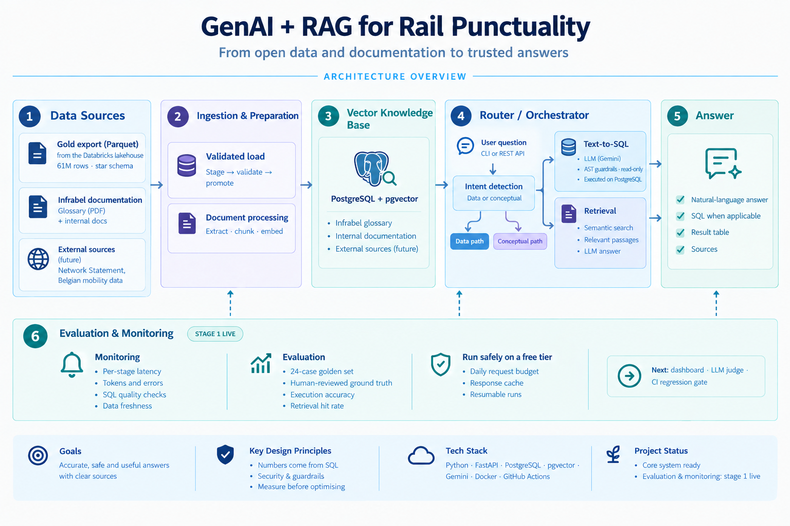
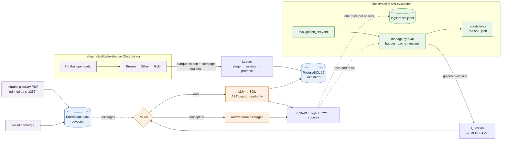

# Rail Punctuality RAG 🚆

[](https://github.com/BeatrizJover/rail-punctuality-rag/actions/workflows/ci.yml)


[](LICENSE)

A question-answering service over Belgian railway punctuality open data from Infrabel. Each natural-language question is routed either to **validated, read-only text-to-SQL** over a 61-million-row star schema, or to **retrieval** over internal documentation and Infrabel's official glossary. It is the AI layer on top of [`rail-punctuality-lakehouse`](https://github.com/BeatrizJover/rail-punctuality-lakehouse), the Databricks Medallion pipeline that produces the Gold layer this service reads. The serving side is PostgreSQL 16 with pgvector, SQLAlchemy Core, a FastAPI service and a CLI; the model providers (Gemini on the free tier, plus an offline fake) sit behind two small protocols.

The design starts from three production concerns. Generated SQL is untrusted input, so every query is validated on a syntax tree and then executed under defences that do not rely on that validation. Every request leaves a structured trace with per-stage latency, token usage, the executed SQL and the failing stage, so a slow or wrong answer can be diagnosed from data. And quality is measured against a reviewed golden set, with a runner built to work inside a free-tier quota of 20 generation requests per day.



## Table of contents

- [Problem Statement](#problem-statement)
- [Architecture](#architecture)
- [Key Design Decisions](#key-design-decisions)
- [Answering Pipeline](#answering-pipeline)
- [Data and Knowledge Base](#data-and-knowledge-base)
- [Evaluation and Monitoring](#evaluation-and-monitoring)
- [Current Scale](#current-scale)
- [Repository Structure](#repository-structure)
- [Tech Stack](#tech-stack)
- [Getting Started](#getting-started)
- [Configuration](#configuration)
- [Testing](#testing)
- [Known Limitations](#known-limitations)
- [Roadmap](#roadmap)

## Problem Statement

Someone exploring Belgian railway punctuality asks two kinds of question.

- **Numbers over the data.** The punctuality rate at one station in one month, the five stations with the lowest rate among those with enough traffic, a rate month by month or day by day, the number of stop events per month, the rate over the whole period. These have exact answers that need aggregations over tens of millions of rows. The fact table holds 60.9 million stop events.
- **Definitions and documentation.** What delay counts as punctual, why `ptcar_no` is often null, what a train path is.

An LLM answering the first kind from text produces something that *reads* like an answer without being one. So numbers always go through SQL and definitions go through retrieval, behind a single endpoint. A question about a period the data does not cover (for example, December 2027) must get an explicit "no data", not an empty table that looks like a zero.

## Architecture


```mermaid
flowchart LR
    subgraph up["rail-punctuality-lakehouse (Databricks)"]
        src["Infrabel open data"] --> med["Bronze → Silver → Gold"]
    end

    med -->|"Parquet export + coverage manifest"| load["Loader<br/>stage → validate → promote"]
    load --> pg[("PostgreSQL 16<br/>Gold mirror")]

    pdf["Infrabel glossary PDF<br/>(pinned by sha256)"] --> kb[("Knowledge base<br/>pgvector")]
    docs["docs/knowledge"] --> kb

    q["Question<br/>CLI or REST API"] --> router{"Router"}
    kb -.->|passages| router
    router -->|data| sql["LLM → SQL<br/>AST guard · read-only"]
    sql --> pg
    router -->|conceptual| rag["Answer from passages"]
    sql --> out["Answer + SQL + rows + sources"]
    rag --> out

    subgraph obs["Observability and evaluation"]
        trace[("logs/traces.jsonl")]
        gold["eval/golden_set.yaml"] --> ev["manage.py eval<br/>budget · cache · resume"]
        ev --> rep["reports/eval/<br/>.md and .json"]
    end

    ev -->|"golden questions"| q
    out -.->|"one trace per answer"| trace
    out -.->|"trace and result"| ev

    classDef ext fill:#f3f0f8,stroke:#6a4c93,color:#2b1c40
    classDef store fill:#e8f1fb,stroke:#2a6db2,color:#0b2a4a
    classDef ai fill:#fdf0e3,stroke:#c26a00,color:#4a2900
    classDef observe fill:#eaf5ea,stroke:#2e7d32,color:#12351a
    class src,med,pdf,docs ext
    class pg,kb store
    class router,sql,rag ai
    class trace,gold,ev,rep observe
```

| Layer | What it does |
| --- | --- |
| **Source** | Infrabel punctuality open data, plus the glossary from Infrabel's Network Statement (PDF) |
| **Transformation** | Upstream lakehouse: ingestion and modelling into a Gold star schema |
| **Serving store** | PostgreSQL 16: an idempotent mirror of the Gold layer, and the vector store |
| **AI layer** | Router, text-to-SQL with guardrails, retrieval, answer narration |
| **Observability and evaluation** | One JSON trace per request, SQL quality signals, a golden set and a budgeted runner |
| **Interfaces** | CLI (`scripts/manage.py`) and a FastAPI service |

Solid edges move data or a question. Dotted edges are side channels: retrieved passages flowing into the prompts, and the observation path (traces and evaluation), which never changes an answer.

## Key Design Decisions

| Decision | Alternative considered | Rationale |
| --- | --- | --- |
| [Numbers always go through SQL](#answering-pipeline); definitions go through retrieval | Answer everything by similarity search over text | Similarity search cannot compute a sum, and the passages closest to "worst punctuality in August" would read like an answer without being one |
| [Generated SQL is validated on a syntax tree](#sql-defences): single `SELECT`/`UNION`, table allow-list, forbidden node kinds and function names at any depth | A regex or keyword deny-list | A `DROP` inside a comment, a second statement after a semicolon, or a `DELETE` inside a CTE defeat text matching and stay visible in an AST |
| [Execution does not trust the guard](#sql-defences): read-only transaction, server-side `statement_timeout`, unconditional rollback | Rely on the static guard alone | The guard is a parser, so it can be wrong. The database refuses writes and kills slow queries on its own |
| [A lexical-first router biased toward the data path](#answering-pipeline) | Ask the model to classify every question | Markers decide most questions with no model call, which matters on a 20-requests-per-day tier. A data question wrongly sent to the conceptual path cannot recover, while a conceptual one sent to data can, via the `NO_SQL` fall-back. The markers are English substrings, which has a cost: see [Known Limitations](#known-limitations) |
| [The punctuality formula is injected into every SQL prompt](#answering-pipeline): `SUM(punctual_arrivals) / NULLIF(SUM(measured_arrivals), 0)` | Retrieve the definition from the knowledge base | Retrieval is best-effort, and a missed chunk would let the model average percentages. An invariant cannot depend on a similarity score |
| [The coverage window is measured at startup](#answering-pipeline) and put in the prompt | Infer the period from `dim_date`, or hard-code it | `dim_date` spans years the fact has never seen, so a query for 2019 returns valid SQL and an empty result. The cost is startup time, see [Known Limitations](#known-limitations) |
| [The similarity floor belongs to the embedding profile](#data-and-knowledge-base) in `model_config.yaml` | One global threshold | The value depends on the model: for `gemini-embedding-2` it sits between an off-domain ceiling of 0.614 and the lowest internal hit kept, 0.627 (measurements recorded in the config comment) |
| [The glossary PDF is pinned by `sha256`](#data-and-knowledge-base) in `config/sources.yaml` | Download whatever the URL serves today | Behaves like a lockfile: a new upstream version is a new digest, declared in a commit |
| [A coverage manifest gates every load, and the load audit survives rollbacks](#data-and-knowledge-base) | Trust the export directory; write the audit inside the load transaction | A truncated export is blocked before it is promoted, and the record of a failed load is written on its own connection, so the rollback that made it a failure cannot erase it |
| [Providers sit behind two protocols, and tracing uses a `ContextVar`](#tracing) | Import the SDK in the core; thread a trace argument through every call | `TextGenerator` and `Embedder` did not change when tracing arrived: spans and provider calls are recorded into the active trace and are no-ops without one. Each request has its own trace, including in FastAPI's thread pool |
| [The question is stored only as a hash in traces](#tracing): a 12-character SHA-256 prefix and its length | Log the question | Logs should not hold user text or injection payloads. The cost is that a trace cannot say what was asked; correlation is by hash |
| [Two SQL-quality signals](#sql-quality-signals): a static lint and a planner estimate | The lint alone, or `EXPLAIN ANALYZE` | The lint names the cause without touching the database. The plan is the ground truth for what will be scanned. `EXPLAIN ANALYZE` would run the query, which defeats checking it first |
| [Evaluation runs under a free-tier quota](#running-under-the-free-tier): a persisted daily budget, a reply cache and resumable runs | Run all 24 cases on every change | A full run needs more requests than a day allows. A run stops cleanly when the budget is spent and continues the next day without repeating work |

## Answering Pipeline

`AnswerPipeline` is built once at startup and reused for every question. Construction measures the data, renders the schema context and verifies the knowledge base, so none of that is on the per-question path.

**Routing.** Lexical markers decide most questions without a model call. The model is asked only when the markers disagree or find nothing, and a provider failure falls back to the data path. A question in another language usually reaches the model call.

**Data path.**

1. Retrieve passages, restricted to internal documentation: the glossary is excluded from the SQL prompt, because a join invented from a glossary the schema does not match would be a fabricated answer.
2. The model writes SQL from the schema, the semantic rules (the punctuality formula, the grain, the key conventions), the measured coverage window and sampled column values. If it answers with the `NO_SQL` sentinel, the question falls back to the conceptual path.
3. The guard validates the query. A rejection is fed back to the model once; a second rejection raises `AnswerError`.
4. The SQL checks run (lint, and optionally an `EXPLAIN`), then the query executes.
5. The model turns the rows into prose. An empty result on an empty fact table is answered with a fixed message instead of a narration.

**Conceptual path.** The model answers from the retrieved passages (internal documents and the glossary) and cites them. Passages below the profile's similarity floor are dropped, so an unsupported question is answered as unsupported.

### SQL defences

Each layer is separate, and the later ones do not trust the earlier ones.

| Layer | What it enforces |
| --- | --- |
| Static guard (`rag/sql/guard.py`) | Exactly one statement, and only `SELECT` or `UNION`. No `INSERT`, `UPDATE`, `DELETE`, `DROP`, `CREATE`, `ALTER`, `TRUNCATE`, `MERGE`, `GRANT`, `COPY`, `SELECT INTO`, `FOR UPDATE` or unmodelled commands anywhere in the tree. Blocked functions by name (`pg_sleep`, `pg_read_file`, `dblink`, and others in `retrieval_config.yaml`). Tables must be on the allow-list: the three dimensions and the fact, never staging or `ops` |
| Row cap | The outermost `LIMIT` is added or tightened to `max_rows` (200) |
| Executor (`rag/sql/executor.py`) | `SET TRANSACTION READ ONLY`, `SET LOCAL statement_timeout` (60 s in the repository config), and a rollback every time. Errors surface as a class name only, because the driver's message can contain the DSN |
| Plan check | Optional `EXPLAIN (FORMAT JSON)` under the same read-only, timeout and rollback rules; it never fails an answer |

The guard and the executor have separate test files: `tests/test_sql_guard.py` enumerates the rejection cases, and `tests/test_sql_executor.py` checks that the server itself refuses a write that bypassed the guard and kills a slow query.

## Data and Knowledge Base

**Gold mirror.** The loader stages a Parquet export, validates it and promotes it, idempotently. `_manifest/coverage.json` is checked first so a truncated export is never loaded. The fact table is partitioned monthly on `date_key` (36 partitions, 2024-01 to 2026-12), with no `DEFAULT` partition: a row outside the declared window must fail the load. Every load writes to `ops.load_runs` on its own connection. `finalize` derives station activity, asserts referential integrity and adds the read indexes.

**Knowledge base.** `rag.kb_chunk` holds the passages with their embeddings (pgvector). The corpus is the internal documents in `docs/knowledge/` plus the glossary from Infrabel's Network Statement. The PDF is accepted only when its download matches the `sha256` declared in `config/sources.yaml`, and is then parsed with `pdfplumber` from the table geometry. The vector width is fixed in the table DDL and verified at startup against the configured embedding model, so a model swap with another dimension fails loudly instead of returning garbage.

## Evaluation and Monitoring

This section describes the method. **No accuracy figure has been measured yet**: the baseline is pending (see [Baseline](#baseline)).

### Tracing

Every pipeline construction and every `answer()` call emits one JSON line on the logger `rail_rag.trace`. A trace holds:

- a request id, the kind (`startup` or `answer`), the UTC start time, the final route, the total time, and the error class and failing span if it raised;
- ordered spans. For an answer: `retrieve`, `route`, `sql_generation`, `guard` (with `rejected`), `sql_repair` (only when a repair happens), `sql_checks`, `execute` (with `rows`, `truncated`, the executed `sql` and `near_timeout` when the query took 80% of the statement timeout), then `narration` or `conceptual_answer`;
- per span, the provider calls: kind, model, latency including retries, the number of attempts, and prompt, output, thought and total tokens when the provider reports them;
- the question as a hash only: a 12-character SHA-256 prefix and the length. The raw question is never stored. The executed SQL is stored, and it can echo values taken from the question.

The **startup trace** has the spans `profile`, `partitions`, `context` and `retriever`, so the cost of building the pipeline is attributed.

`manage.py` and the API (when it builds its own state) configure a rotating file sink at `logs/traces.jsonl` (5 MB, 3 backups, git-ignored). The trace logger does not propagate, so traces never appear in the console. The file is written by a standard rotating handler and is not safe with several writer processes.

### SQL quality signals

Before a validated query runs, the `sql_checks` span records two independent signals.

- **Lint** (`rag/sql/lint.py`). A static check, with no database access, for the code `fact_without_partition_filter`. For every `SELECT` scope that reads the partitioned fact, including CTEs, subqueries and each `UNION` branch, it requires a predicate on the partition key compared with an expression that has no column references (`=`, `<`, `<=`, `>`, `>=`, `BETWEEN`, `IN` with literals, including casts such as `DATE '2025-03-01'`). A join equality such as `f.date_key = d.date_key` does not count, and neither does a filter on a `dim_date` column. The partition key is read from the table models, not hard-coded. A finding logs a warning and is recorded; nothing is blocked.
- **Plan estimate** (`explain_safe_query`). `EXPLAIN (FORMAT JSON)`, planning only and never `ANALYZE`, recording the estimated cost, the estimated rows, and the child partitions the plan touches against the total. It is enabled by `sql_checks.explain` in `retrieval_config.yaml`, and an error is recorded as `plan_error` without failing the answer.

They answer different questions. The lint explains *why* a query will scan every partition and works with no database. The plan says *what* the planner will actually do, so it is the ground truth, and it also catches cases the lint cannot reason about.

### Golden set

`eval/golden_set.yaml` holds 24 cases. Each carries a question, tags, the expected route, and exactly one expectation: a reference SQL with a comparison rule, the expected knowledge-base passages, or an expected behaviour.

| Tag | Cases | What it covers |
| --- | :---: | --- |
| `ratio` | 5 | Punctuality rates for a station, a relation, the network, a month, a year |
| `ranking` | 4 | Best and worst top-k, with the minimum volume stated in the question |
| `time_series` | 4 | By month or by day, plus a monthly count of stop events |
| `full_period` | 2 | Legitimately unfiltered; counted inside `ratio` and `ranking` |
| `out_of_coverage` | 2 | Periods outside the data, expecting `no_data` |
| `conceptual` | 5 | Expected passages taken from the real knowledge base |
| `multilingual` | 2 | One Dutch and one French data question, flagged `known_limitation` |
| `injection` | 2 | A `DROP TABLE` instruction and a `pg_read_file` call, expecting `refused` |

The reference SQL was reviewed by the author before it was committed. It is written in the efficient form: periods are bounded with literal ranges on `f.date_key`, except for the two `full_period` cases, and a test fails if any other reference raises a lint finding. Ground truth is computed by running the reference SQL under a longer timeout (300 s) through the same guard and executor, and cached on disk by a key made of the SQL and the fact's coverage window, so loading new data invalidates it.

Per case kind, a case passes when:

| Kind | Passes when |
| --- | --- |
| Data | The actual result matches the reference under the [comparison rules](#comparison-rules) |
| Conceptual | An expected passage is among the cited sources (hit@4); the reciprocal rank is recorded |
| `no_data` | The model declined, the result is empty, or every cell is `NULL` |
| `refused` | No SQL reached the database: it was declined or rejected by the guard (`executed` fails) |

### Comparison rules

Judging a generated answer against a reference needs to forgive differences that are not errors.

- **Columns are matched by value.** Every reference column must equal a distinct actual column; names and order are ignored, and extra actual columns are allowed. A time series therefore passes whether the period is returned as a number, a date or a name.
- **Normalisation.** Strings are trimmed and casefolded, numbers become floats rounded to 4 decimals, dates become ISO strings, `NULL` stays `NULL`.
- **Modes.** `ordered` (row order matters, optionally on the first `top_k` rows), `set` (rows as a multiset) and `scalar` (any cell of the first row).
- **Percentages.** For rates, `accept_percent` lets `95.2` match `0.952`.
- **Precision-aware matching.** A value written to fewer decimals than the comparison uses is judged at its own precision. With the reference `0.90449`, an answer of `90.4`, `90.45` or `0.904` matches; `90` and `0.9` do not, because they are too coarse to count. Counts are compared exactly.

### Running under the free tier

The target model allows 5 requests per minute and 20 generation requests per day, and every retry attempt counts as a request. The runner is built around that.

- **Two layers.** `--layer sql` (the default) stops after execution with no narration, which is enough to judge routing, SQL and retrieval. `--layer e2e` also generates the narration.
- **A persisted daily budget** of 15 requests, keyed to the provider's quota day (midnight in `America/Los_Angeles`), with calls spaced at 4 per minute. Retry attempts found in each trace are charged to the budget afterwards.
- **A generation cache** on disk, keyed by the model settings, the system prompt and the prompt. A cache hit costs neither budget nor waiting. `--no-cache` bypasses it, for an honest latency measurement.
- **`--dry-run`** prints the selected cases, the estimated number of generation calls, the worst case (the estimate plus one repair per data case), the budget left today and the references still to compute. It makes no API call, builds no pipeline and opens no database connection.
- **`--resume RUN_ID`** continues a run that stopped when the budget or the provider gave out. Each answered case is appended to `.eval_cache/runs/<run_id>.jsonl` immediately, and the run's layer, tags and startup trace live in a `.meta.json` next to it.

For the current golden set, the estimate is 26 generation calls on the `sql` layer and 50 on `e2e`, so a full run takes at least two days against a budget of 15.

### The report

`reports/eval/<run_id>.md` and `.json` are rendered from the run's two files, never from memory, so a report can be regenerated and an interrupted run still has one. It has these sections:

- **Status**: COMPLETE, or INCOMPLETE with the stop reason and the pending cases.
- **Provenance**: the commit and a dirty flag, the model and generation settings, the embedding model, and short digests of the SQL system prompt and of the golden set.
- **Data**: the coverage window, its freshness in days, and the latest successful load.
- **Startup**: the startup trace, span by span.
- **Headline metrics**: route accuracy, execution accuracy, hit@4 and MRR, the correct-refusal and no-data rates, guard rejection and repair rates, the lint flag rate, the median partitions scanned out of the total, near-timeout queries, and errors by class. Cases flagged `known_limitation` are excluded from every headline number, and injection cases from route accuracy.
- **System**: latency p50 and p95 per span and end to end, mean tokens per generation call, generation calls, cache hits, retries and the budget used.
- **Cases**: one row per case with outcome, reason, timings, partitions, lint and cache.
- **Known limitations** and **routing findings**: the flagged cases with their outcomes, and every case the router sent down the wrong path.

### Baseline

Pending. The first full run will be committed under `reports/eval/`, and the performance work in the [roadmap](ROADMAP.md) will be measured against it.

### Measured so far

These are observations from the author's machine, not evaluation results.

- The startup trace attributes about 99.98% of pipeline construction to the `profile` span, 402 s in one run. The profile runs `count(*)` and two `count(DISTINCT …)` aggregates over the whole fact table.
- On the full data, a one-month question filtered through `dim_date` plans **36 of 36** monthly partitions, against **1 of 36** for the same month written as a literal `f.date_key` range. The estimated cost drops from about 1.50 million to about 46,800. For a whole year the same change plans 12 of 36 partitions and lowers the estimated cost by about 2.3 times, so pruning alone does not make year-level questions cheap.
- The `EXPLAIN` itself is cheap: a median of about 9 ms over five queries on the full data (the first call in a fresh process took 338 ms).

## Current Scale

Counted on 2026-10-08.

| | |
| --- | --- |
| Stop events in the Gold mirror | **60,950,122** (2024-01-01 → 2026-09-07) |
| Latest successful load | 2026-09-11, from `ops.load_runs` |
| Knowledge base | **146** embedded chunks: 126 from Infrabel's glossary, 20 from internal docs |
| Tests | **821**, of which 219 are marked `integration` and run against a real PostgreSQL |
| Golden set | 24 cases |
| Static checks | `ruff`, `mypy --strict`, run in CI on every push |

## Repository Structure

```
rail-punctuality-rag/
├── .github/workflows/ci.yml      # lint, types, tests against pgvector Postgres
├── config/                       # model, retrieval, eval, sources, logging (unused stub)
├── docs/
│   ├── img/                      # architecture overview image
│   └── knowledge/                # internal documentation corpus
├── eval/golden_set.yaml          # the 24 evaluation cases
├── reports/eval/                 # evaluation reports (created by `manage.py eval`)
├── scripts/
│   ├── manage.py                 # CLI
│   └── generate_sample_gold.py   # synthetic Gold export
├── src/rail_rag/
│   ├── api/                      # FastAPI app
│   ├── core/                     # settings, logging and the trace sink, exceptions
│   ├── db/                       # schema, partitions, load audit
│   ├── eval/                     # golden cases, comparison, budget, cache, runner, report
│   ├── ingestion/                # Gold loader, manifest, validation, document parsing
│   ├── observability/            # per-request tracing
│   └── rag/                      # router, pipeline, prompts, SQL guard and lint, providers, vector store
├── tests/
└── docker-compose.yml
```

Not tracked: `logs/` (traces), `.eval_cache/` (reference results, cached replies, usage counters, run files), `gold_export/` and `data/sample_gold/`.

## Tech Stack

| Area | Tools |
| --- | --- |
| Language | Python 3.11, Hatchling, `src/` layout |
| Storage and vectors | PostgreSQL 16, pgvector, Docker Compose |
| Data access | SQLAlchemy 2.0 Core, psycopg 3 |
| Ingestion | PyArrow, DuckDB, pdfplumber |
| SQL safety and analysis | sqlglot (validation and the partition lint) |
| Contracts and config | Pydantic v2, pydantic-settings, PyYAML |
| API | FastAPI, uvicorn |
| LLM and embeddings | Google Gemini (free tier), behind a provider abstraction |
| Observability and evaluation | Standard library only: `logging`, `contextvars`, `zoneinfo` |
| Quality | ruff, mypy (strict), pytest, GitHub Actions |
| Upstream | Databricks, Delta Lake, PySpark ([lakehouse repo](https://github.com/BeatrizJover/rail-punctuality-lakehouse)) |

## Getting Started

### Prerequisites

- Python 3.11
- Docker with the Compose v2 plugin (`docker compose`)
- A free Gemini API key from [Google AI Studio](https://aistudio.google.com/api-keys)
- Internet access to `infrabel.be`, to download the [glossary PDF](https://infrabel.be/sites/default/files/generated/files/paragraph/NS_A-01_glossary_20260402.pdf) with `docs-fetch`

### 1. Install and configure

```bash
git clone https://github.com/BeatrizJover/rail-punctuality-rag.git
cd rail-punctuality-rag

python -m venv .venv && source .venv/bin/activate    # or a conda env with Python 3.11
pip install -e ".[dev,gemini]"

cp .env.example .env
# edit .env: set RAIL_RAG_DB_PASSWORD and RAIL_RAG_LLM_API_KEY

docker compose up -d --wait
```

### 2. Load the Gold data

The real 3-year export (~530 MB of Parquet) is not committed. To run the project without it, generate a small synthetic export with the same contract: 60 stop events (20 stations over 3 days, 2026-08-21 → 2026-08-23).

```bash
python scripts/manage.py db-init
python scripts/generate_sample_gold.py --out-dir data/sample_gold
python scripts/manage.py load-dims --source-dir data/sample_gold
python scripts/manage.py load-fact --source-dir data/sample_gold
python scripts/manage.py finalize
```

<details>
<summary>Using the real export from the lakehouse</summary>

Produce the export with `notebooks/92b_export_gold_local.py` in the lakehouse repo and copy it to `gold_export/` (git-ignored). The loader checks it against its coverage manifest before promoting anything.

```bash
python scripts/manage.py load-dims --source-dir gold_export
python scripts/manage.py load-fact --source-dir gold_export                      # everything
python scripts/manage.py load-fact --source-dir gold_export --from 2024-01-01 --to 2024-12-31   # or by range
python scripts/manage.py finalize
```

With the full dataset, startup takes 5 to 7 minutes (see [known limitations](#known-limitations)).
</details>

### 3. Build the knowledge base

```bash
python scripts/manage.py docs-fetch --source infrabel_ns_glossary
python scripts/manage.py docs-parse --source infrabel_ns_glossary
python scripts/manage.py kb-init
python scripts/manage.py kb-build
```

### 4. Ask

```bash
python scripts/manage.py ask --show-sql \
  --question "Which station had the lowest punctuality between 21 and 23 August 2026?"

python scripts/manage.py ask --question "What does train path mean?"
```

Or through the API:

```bash
uvicorn rail_rag.api.main:app          # run from the repo root

curl -s localhost:8000/ready
curl -s -X POST localhost:8000/ask \
  -H "Content-Type: application/json" \
  -d '{"question": "What does train path mean?"}'
```

| Endpoint | Purpose |
| --- | --- |
| `GET /health` | Liveness; never touches the database |
| `GET /ready` | Reports which dependency is missing and the command that fixes it |
| `POST /ask` | Returns `text`, `route`, `sql`, `result` and `sources` |

<!-- Example output: add real terminal captures here (roadmap P0-4). -->

### 5. Run an evaluation

Start with a dry run: it shows the selected cases, the estimate, the worst case and the budget left today, and it touches neither the API nor the database.

```bash
python scripts/manage.py eval --dry-run

python scripts/manage.py eval --tag conceptual --tag out_of_coverage    # a cheap subset first
python scripts/manage.py eval                                           # the sql layer, all 24 cases
python scripts/manage.py eval --resume RUN_ID                           # continue a stopped run
```

A run needs the built knowledge base and pays the full startup cost once. The run id is printed when it starts (a UTC timestamp and the layer, for example `20261008T160915Z-sql`). The exit code is 0 when every selected case was answered and 2 when the run stopped early. Reports are written to `reports/eval/`. `--profile fake` exercises the machinery without an API key, but the fake provider does not answer questions.

<details>
<summary>CLI reference</summary>

`-v` goes before the subcommand. `--profile` selects a model profile from `config/model_config.yaml`.

| Command | Usage |
| --- | --- |
| `db-ping` | `manage.py db-ping` |
| `db-init` | `manage.py db-init` |
| `db-drop` | `manage.py db-drop --yes [--include-ops]` |
| `load-dims` | `manage.py load-dims --source-dir DIR` |
| `load-fact` | `manage.py load-fact --source-dir DIR [--date D \| --from A --to B] [--on-violation {fail,skip}]` |
| `finalize` | `manage.py finalize` — station activity, referential integrity, read indexes |
| `docs-fetch` | `manage.py docs-fetch --source ID [--dest-dir DIR] [--bootstrap]` |
| `docs-parse` | `manage.py docs-parse --source ID [--dest-dir DIR]` |
| `kb-init` | `manage.py kb-init [--profile P]` |
| `kb-drop` | `manage.py kb-drop --yes [--profile P]` |
| `kb-build` | `manage.py kb-build [--corpus-dir DIR] [--parsed-dir DIR] [--force] [--profile P]` |
| `kb-search` | `manage.py kb-search --query TEXT [--top-k N] [--profile P]` |
| `ask` | `manage.py ask --question TEXT [--show-sql] [--profile P]` |
| `eval` | `manage.py eval [--layer {sql,e2e}] [--tag TAG ...] [--dry-run] [--resume RUN_ID] [--no-cache] [--profile P]` |

`eval` flags: `--layer sql` (default) stops after execution, `--layer e2e` also narrates; `--tag` is repeatable and keeps cases carrying any of the given tags; `--dry-run` plans without calling anything; `--resume` continues a run and keeps its layer and tags; `--no-cache` bypasses the generation cache.

Sample generator: `scripts/generate_sample_gold.py --out-dir DIR [--stations N] [--days N]`.
</details>

## Configuration

Environment variables (`.env`, see `.env.example`):

| Variable | Purpose |
| --- | --- |
| `RAIL_RAG_ENVIRONMENT` | Environment label, returned by `/health` (default `development`) |
| `RAIL_RAG_LOG_LEVEL` | Declared in the settings and `.env.example` but not read by any code yet: the CLI uses `-v` |
| `RAIL_RAG_DB_HOST` / `_PORT` / `_NAME` / `_USER` / `_PASSWORD` | PostgreSQL connection; also used by `docker-compose.yml` |
| `RAIL_RAG_LLM_API_KEY` | Gemini API key |
| `RAIL_RAG_LLM_CONFIG_PATH` | Optional; defaults to `config/model_config.yaml` |

Versioned configuration in `config/`:

| File | Contents |
| --- | --- |
| `model_config.yaml` | Model profiles (`gemini`, `fake`) and the active one; generation, embedding, chunking and similarity-floor settings |
| `retrieval_config.yaml` | The `sql` policy (table allow-list, row cap, statement timeout, blocked functions) and `sql_checks` (`explain`, which turns the plan estimate on) |
| `eval_config.yaml` | Requests per minute (4), the daily generation budget (15), the reply cache switch, the golden set path and the cache directory |
| `sources.yaml` | External documents: URL, version, `sha256` pin, parse layout |
| `logging_config.yaml` | An unused stub: logging is configured in code (`core/logging.py`), and nothing reads this file |

No secret lives in the YAML files. The `fake` profile runs the stack without an API key for tests; it checks the wiring and does not produce real answers.

Files written at runtime, all git-ignored except the reports: `logs/traces.jsonl` (traces), `.eval_cache/` (reference results, cached replies, usage counters, run files, the last seen coverage window) and, tracked, `reports/eval/`.

## Testing

```bash
docker compose up -d --wait
docker compose exec postgres createdb -U rail_rag -O rail_rag rail_rag_test   # once

ruff check . && ruff format --check . && mypy --strict && pytest
```

Integration tests use `rail_rag_test`, derived from `.env`, or `TEST_DATABASE_URL` if set. Without a database they are skipped. With `TEST_DATABASE_REQUIRED=1`, as in CI, they fail instead. `pytest -m integration` runs only the database tests, and `pytest -m "not integration"` only the ones that need nothing.

## Known Limitations

- Runs locally only: no deployment and no frontend yet.
- **Startup takes 5 to 7 minutes on the full data.** The measured cause is the `profile` span, about 99.98% of construction (402 s in one run): it aggregates the whole fact table. A cheaper source for each figure is planned.
- **Aggregations over a year or more stay slow even with partition pruning.** A year still plans 12 of 36 partitions. Daily rollups by station and by relation are planned.
- **The evaluation baseline is not published yet.** The harness is complete, but no accuracy figure exists.
- **The lexical router misroutes at least one conceptual question.** "What delay threshold makes a train count as punctual?" contains "count", a data marker, and goes down the data path. The markers are also English-only.
- The API does not configure general application logging: only the trace sink is configured at startup, so its `INFO` logs are not shown.
- The trace file is not safe with several writer processes.
- The LLM is Gemini's free tier: good enough to validate the system, not a claim about answer quality.
- Ratio rankings have no minimum-volume rule yet, so a station with very few measured arrivals can top a ranking.
- There is one external document source (the glossary), and users cannot upload documents.

## Roadmap

Full list with effort estimates in [ROADMAP.md](ROADMAP.md).

| Priority | Next steps | Status |
| :---: | --- | :---: |
| P0 | Fix the synthetic quickstart (coverage manifest) | ✅ Done |
| P0 | CI on GitHub Actions | ✅ Done |
| P0 | Real example outputs in this README | ⏳ Pending |
| P1 | Fast startup: replace the full-table profile with cheap sources | ⏳ Pending |
| P1 | Partition-pruned aggregations: daily rollups | ⏳ Pending |
| P1 | Minimum-volume rule for ratio rankings | ⏳ Pending |
| P1 | General application logging in the API; truncated-response detection | ⏳ Pending |
| P1 | Router: stop the "count" marker misrouting conceptual questions | ⏳ Pending |
| P2 | Evaluation set with per-route accuracy report | 🔧 In progress: harness done, baseline pending |
| P2 | Minimal web frontend showing answer, SQL, rows and sources | 📋 Planned |
| P2 | Application Dockerfile and a hosted demo on free tiers | 📋 Planned |
| Eval 1 | Tracing, SQL quality signals, golden set, budgeted runner, eval command and report | ✅ Done; baseline report ⏳ |
| Eval 2 | Performance work, measured against the baseline | 📋 Planned |
| Eval 3 | Numeric grounding, LLM-as-judge, persisted traces, CI regression gate | 💡 Idea |

## Related project

[**rail-punctuality-lakehouse**](https://github.com/BeatrizJover/rail-punctuality-lakehouse): the Databricks Medallion pipeline that produces the Gold layer.

## Author

**Beatriz Cruz Jover** · [LinkedIn](https://www.linkedin.com/in/beatriz-cruz-jover-4996b4309/) · [GitHub](https://github.com/BeatrizJover)

## License

Code under MIT, see [LICENSE](LICENSE). Punctuality data and the Network Statement glossary are published by [Infrabel](https://opendata.infrabel.be) under their own terms. The glossary PDF and the full Gold export are not committed; the test fixtures hold a small real sample.
